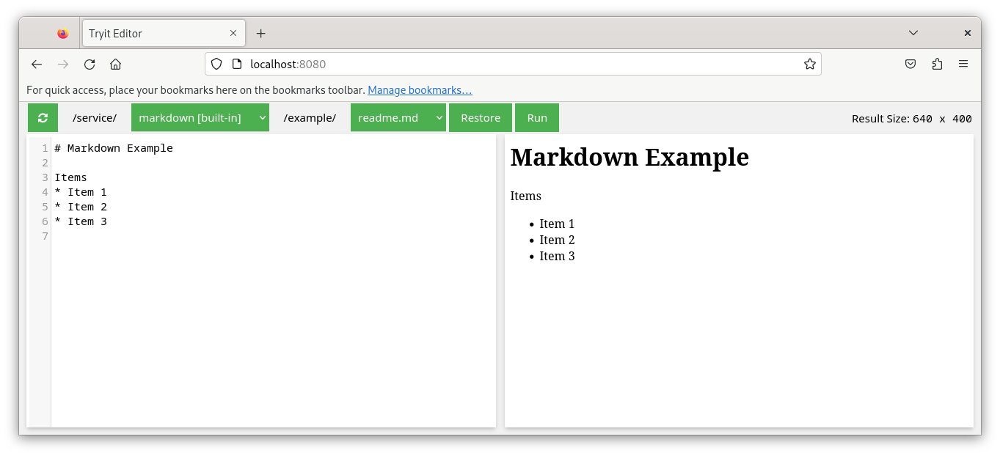

# Tryit Editor

WYSIWYG editor for custom services. Customs service is defined in a YAML file as follows
	
    - exec: bash
      examples:
        - timestamp.sh
        - multi-line.sh

An example how to add a custom service can be found at https://github.com/apodhrad/tryit-editor-pict

## Screenshot

## Usage
Run the container image as follows

    podman run -it --rm -p 8080:8080 quay.io/apodhrad/tryit-editor:latest

and navigate to http://localhost:8080
